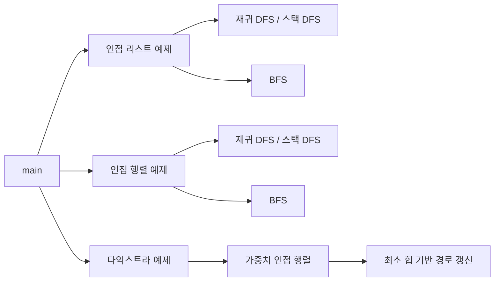

# C++ Data Structures Study

C++17로 트리, 힙, 그래프를 직접 구현하며 자료구조의 내부 동작을 학습한 프로젝트입니다. 단순히 실행되는 코드를 만드는 데서 끝내지 않고, **표현 방식에 따라 메모리 사용과 탐색 비용이 왜 달라지는지**를 이해하는 데 집중했습니다.

학습 중 생긴 질문과 답을 코드 주석으로 남겼으며, 같은 그래프를 인접 리스트와 인접 행렬로 구성해 DFS·BFS의 구현과 실행 결과를 직접 비교할 수 있도록 했습니다.

## 프로젝트 목표

- 트리, 힙, 그래프의 내부 구조 직접 구현
- 인접 리스트와 인접 행렬의 공간·시간 트레이드오프 이해
- 재귀 DFS, 스택 DFS, BFS의 탐색 순서와 상태 관리 비교
- 가중치 그래프에서 다익스트라가 최단 경로를 갱신하는 과정 이해
- 구현 과정의 판단 근거와 주의점을 코드 주석으로 기록

## 강의 기반과 차별화

강의에서 학습한 자료구조와 그래프 탐색 개념을 바탕으로 시작했습니다. 강의 예제를 그대로 따라가는 데서 끝내지 않고, 표현 방식과 탐색 방법을 같은 조건에서 비교하고 실행 구조를 다음과 같이 확장했습니다.

- 같은 정점과 간선을 인접 리스트와 인접 행렬로 각각 구성
- DFS를 재귀 호출과 명시적 `stack` 방식으로 모두 구현
- 시작점과 연결되지 않은 정점까지 확인하는 전체 순회 추가
- BFS에 방문 여부뿐 아니라 부모와 시작점으로부터의 거리 기록
- `std::pair` 대신 의미가 드러나는 `VertexCost` 구조체로 다익스트라 후보 표현
- 인접 리스트, 인접 행렬, 다익스트라 예제를 독립 실행 함수로 분리

## 주요 구현

### 트리와 Priority Queue

- 자식 목록을 갖는 일반 트리 생성
- 재귀를 이용한 트리 출력과 높이 계산
- 벡터를 완전 이진 트리로 사용하는 `PriorityQueue`
- Predicate에 따라 최소 힙과 최대 힙을 선택할 수 있는 템플릿 구조

트리와 직접 구현한 `PriorityQueue`는 학습 단계별 코드를 보존하기 위해 현재 `#if 0` 영역에 두었습니다. 관련 코드: [`DataStructures.cpp`](DataStructures.cpp)

### 그래프 표현

동일한 무방향 그래프를 두 가지 방식으로 저장했습니다.

| 구분 | 인접 리스트 | 인접 행렬 |
| --- | --- | --- |
| 저장 공간 | `O(V + E)` | `O(V²)` |
| 두 정점의 연결 확인 | 해당 정점의 이웃 수에 비례 | `O(1)` |
| DFS·BFS 전체 순회 | `O(V + E)` | `O(V²)` |
| 적합한 경우 | 간선이 적은 희소 그래프 | 밀집 그래프 또는 빠른 연결 조회 |

인접 리스트는 실제 간선만 저장해 희소 그래프에 유리합니다. 인접 행렬은 연결되지 않은 관계까지 저장하는 대신 두 정점의 연결 여부를 즉시 확인할 수 있습니다. 관련 코드: [`CreateAdjacencyListGraph`, `CreateAdjacencyMatrixGraph`](DataStructures.cpp)

### DFS와 BFS

재귀 DFS는 함수 호출 스택을 사용하고, 반복 DFS는 같은 동작을 `std::stack`으로 직접 표현했습니다. 스택에 이웃을 넣는 순서에 따라 재귀 방식과 방문 순서가 달라질 수 있다는 점도 출력으로 확인합니다.

BFS는 정점을 큐에 넣는 순간 `discovered`를 기록해 중복 삽입을 막습니다. 각 정점을 처음 발견한 부모와 시작점으로부터의 거리도 함께 저장하므로, 무가중치 그래프의 최단 경로를 복원하는 기반으로 사용할 수 있습니다. 관련 코드: [`ListDFS`, `MatrixDFS`, `ListBFS`, `MatrixBFS`](DataStructures.cpp)

### 다익스트라 최단 경로

가중치 인접 행렬과 최소 힙을 사용해 시작점에서 각 정점까지의 최단 비용을 계산합니다. 더 짧은 경로를 발견하면 `best`와 `parent`를 갱신하고 새로운 후보를 큐에 넣습니다. 이후 큐에서 오래된 후보가 나오면 현재 최단 비용과 비교해 건너뜁니다.

현재 구현은 **음수 가중치를 지원하지 않습니다.** 관련 코드: [`VertexCost`, `Dijkstra`](DataStructures.cpp)

## 실행 결과

같은 6개 정점 그래프에서 각 실행 함수를 확인한 결과입니다. DFS의 방문 순서는 이웃을 저장하거나 스택에 넣는 순서에 따라 달라질 수 있습니다.

| 실행 항목 | 방문 또는 최단 비용 결과 |
| --- | --- |
| 재귀 DFS | `0 → 1 → 2 → 3 → 4 → 5` |
| 스택 DFS | `0 → 3 → 4 → 5 → 1 → 2` |
| BFS | `0 → 1 → 3 → 2 → 4 → 5` |
| Dijkstra | `0, 15, 20, 25, 30, 35` |

## 실행 구조



[`DataStructures.cpp`](DataStructures.cpp)의 `main()`에서 원하는 함수의 주석을 해제해 실행합니다.

```cpp
int main()
{
	//RunAdjacencyListExample();
	//RunAdjacencyMatrixExample();
	RunDijkstraExample();
}
```

## 주석으로 남긴 학습 기록

주석은 코드의 문법을 다시 읽어주는 설명보다, 구현하면서 생긴 **“왜?”에 대한 답**을 남기는 데 사용했습니다.

| 주제 | 주석에 정리한 내용 | 관련 코드 |
| --- | --- | --- |
| 인접 리스트와 행렬 | 희소·밀집 그래프에 따른 저장 공간과 조회 비용 | [`DataStructures.cpp`](DataStructures.cpp) |
| 재귀와 스택 | 재귀 호출을 명시적 스택으로 바꾸는 과정과 방문 순서 | [`ListStackDfs`, `MatrixStackDfs`](DataStructures.cpp) |
| BFS 상태 기록 | 큐에 넣을 때 발견 표시를 해야 하는 이유와 거리 계산 | [`ListBFS`, `MatrixBFS`](DataStructures.cpp) |
| 다익스트라 | 오래된 후보가 큐에 남는 이유와 최단 비용 갱신 조건 | [`Dijkstra`](DataStructures.cpp) |

## 학습 중 발견하고 수정한 문제

- 표현 방식마다 간선 구성이 달라 직접 비교하기 어려웠던 예제를 동일한 무방향 그래프로 통일
- 인접 리스트와 인접 행렬 코드가 주석 영역에 흩어져 있던 구조를 독립 실행 함수로 분리
- 인접 리스트 순회를 `O(V + E)`, 인접 행렬 순회를 `O(V²)`로 구분해 잘못된 복잡도 설명 수정
- `Dijikstra`로 표기했던 함수와 출력 이름을 `Dijkstra`로 수정
- BFS에서 큐에 넣는 순간 발견 여부를 기록해 같은 정점이 중복으로 들어가는 상황 방지

## 개발 환경

- Windows 10 SDK
- Visual Studio 2022 / MSVC v143
- C++17
- Console Application

## 빌드 및 실행

1. Visual Studio 2022에서 [`CppWorkspace.sln`](../CppWorkspace.sln)을 엽니다.
2. `DataStructures`를 시작 프로젝트로 설정합니다.
3. `Debug | x64` 구성에서 빌드하고 실행합니다.
4. 다른 그래프 예제를 확인하려면 `main()`의 실행 함수 주석을 변경합니다.
