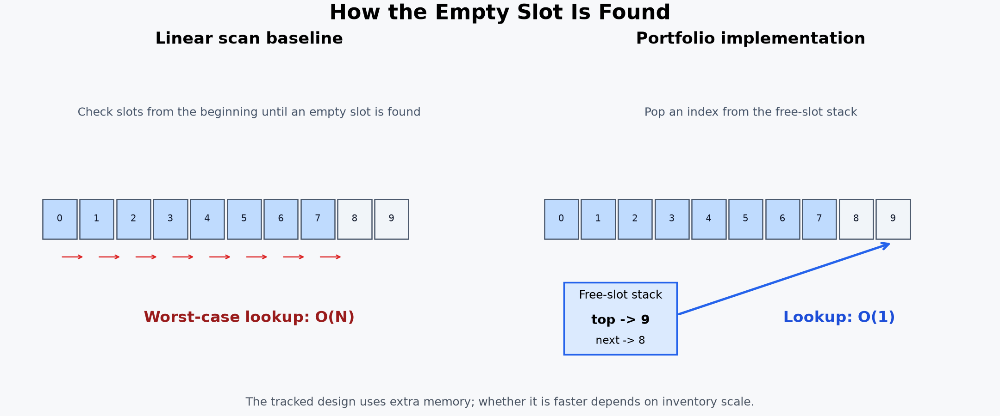

# Inventory

고정 크기 인벤토리의 슬롯 관리와 랜덤 아이템 삭제를 다루는 C++17 학습 프로젝트입니다.

## 프로젝트 구성

- `InventoryCore`: 인벤토리, 아이템, 난수 기능을 담은 공통 정적 라이브러리
- `InventoryDemo`: `InventoryCore`를 사용하는 간단한 실행 예제
- `InventoryTests`: `InventoryCore`를 직접 참조하는 경계값·소유권 자동 테스트
- `InventoryBenchmark`: 개선 전후 알고리즘을 독립적으로 재현한 성능 측정 프로그램

데모와 테스트가 같은 정적 라이브러리를 참조하므로, 테스트용으로 구현을 복사하지 않습니다. `ItemHandle`은 찾기 쉽도록 [`ItemHandle.h`](ItemHandle.h)에 별도로 정의했습니다.

## 작성 범위와 출처

C++ 강의에서 학습한 고정 크기 포인터 배열 기반 인벤토리를 출발점으로 삼았지만, 이 저장소의 구현은 직접 작성했습니다. 강의의 원본 소스코드, 주석, 과제 자료는 포함하지 않습니다.

`InventoryBenchmark`의 `LinearScanInventory` 역시 강의 원본을 복원하거나 복사한 코드가 아닙니다. 선형 탐색이라는 알고리즘의 성능 특성을 비교하기 위해 독립적으로 작성한 최소 베이스라인입니다.

## 강의와의 차별화

- 빈 슬롯을 매번 선형 탐색하지 않고 스택으로 관리
- 점유 슬롯을 벡터로 관리하여 실제 아이템이 있는 슬롯만 무작위 추출
- 역방향 위치표와 `swap-and-pop`을 사용해 점유 벡터에서 슬롯을 순서 이동 없이 제거
- `std::unique_ptr<Item>`으로 인벤토리의 아이템 소유권을 명시하고 수동 `delete` 제거
- 슬롯 번호와 세대 번호를 가진 `ItemHandle`로 포인터 선형 검색을 제거하고 오래된 참조를 검출
- `srand`, `rand` 대신 `random_device`, `mt19937`, `uniform_int_distribution` 적용
- 중복 없이 여러 항목을 선택하기 위해 `std::sample` 적용
- 범위를 벗어난 인덱스와 중복 삭제 요청을 안전하게 처리

자료구조 변경은 추가 메모리를 사용하는 대신 슬롯 탐색 비용을 줄이는 선택입니다. 실제 이득은 슬롯 수와 점유율에 따라 달라질 수 있으므로 `InventoryBenchmark`에서 별도로 측정합니다.

`swap-and-pop`은 벡터 원소의 순서를 보존하지 않습니다. 현재 점유 슬롯 벡터는 표시 순서나 정렬에 사용하지 않으므로 순서 보존보다 삭제 비용을 줄이는 쪽을 선택했습니다. 이후 `ItemHandle`을 도입해 실제 슬롯을 찾는 포인터 선형 탐색도 제거했으므로, 유효한 핸들을 사용한 단일 삭제의 슬롯 조회와 점유 벡터 정리는 모두 `O(1)`입니다.

`AddItem(std::unique_ptr<Item>)`은 호출자가 가진 소유권을 인벤토리로 이전하고 성공 시 `ItemHandle`을 반환합니다. 추가에 실패하거나 아이템을 삭제하거나 프로그램이 종료되는 경우에도 `unique_ptr`이 아이템을 자동으로 해제합니다. `FindItem(handle)`이 반환하는 `Item*`는 짧게 사용하는 소유권 없는 관찰용 포인터이며, 장기 참조에는 포인터 대신 핸들을 보관합니다.

핸들은 슬롯 번호와 세대 번호로 구성됩니다. 삭제된 슬롯이 다시 사용되면 세대 번호가 바뀌므로, 오래된 핸들이 새 아이템을 잘못 조회하거나 삭제하는 것을 막을 수 있습니다. 슬롯별 세대 번호 메모리와 상태 관리 복잡도를 추가로 지불하는 공간-시간 트레이드오프입니다.

## 검증 프로젝트

### InventoryTests

다음 경계 조건을 별도 실행 파일에서 확인합니다.

테스트 결과: **35개 통과, 실패 0개**

소유권 이동, 삭제 시 정확히 한 번 소멸, 가득 찬 인벤토리가 거절한 아이템의 자동 해제도 검증합니다. 같은 테스트를 AddressSanitizer로 실행해 메모리 오류가 없음을 확인했습니다.

- 빈 인벤토리와 `nullptr` 처리
- 음수 및 범위 밖 슬롯을 가진 핸들 처리
- 최대 슬롯 수까지 추가 및 용량 초과 거절
- 중복 핸들이 한 번만 삭제되는지 확인
- 삭제 후 슬롯이 재사용되어도 오래된 핸들이 새 아이템에 접근하지 못하는지 확인
- 아이템이 하나뿐일 때도 랜덤 삭제가 동작하는지 확인
- 삭제한 슬롯을 다시 사용할 수 있는지 확인

### InventoryBenchmark

선형 탐색 방식과 빈 슬롯 추적 방식을 동일한 조건에서 비교합니다. 콘솔 출력과 아이템 생성 비용은 측정에서 제외하며, 슬롯 수와 점유율별 아이템 추가 시간을 `ns/op`로 출력합니다.

벤치마크는 최적화가 적용되는 `Release x64`로 빌드하고 디버거 없이 실행해야 합니다. 각 항목을 5회 실행한 중앙값을 출력하며, `Ratio`가 1보다 크면 빈 슬롯 추적 방식이 더 빠르다는 의미입니다.

현재 개발 환경에서 측정한 결과와 해석은 [벤치마크 결과](../InventoryBenchmark/RESULTS.md)에 기록했습니다.

`std::find + vector::erase`와 역방향 위치표를 사용한 `swap-and-pop`의 삭제 비교는 [삭제 벤치마크 결과](../InventoryBenchmark/REMOVAL_RESULTS.md)에 기록했습니다.

포인터 선형 검색과 세대 핸들의 조회 비교는 [핸들 조회 벤치마크 결과](../InventoryBenchmark/LOOKUP_RESULTS.md)에 기록했습니다.

