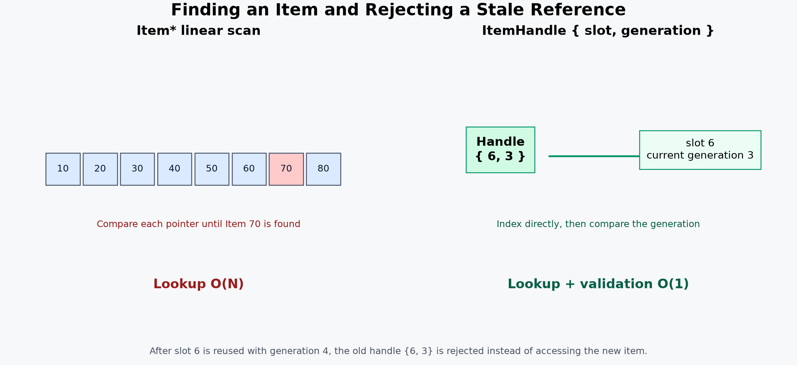
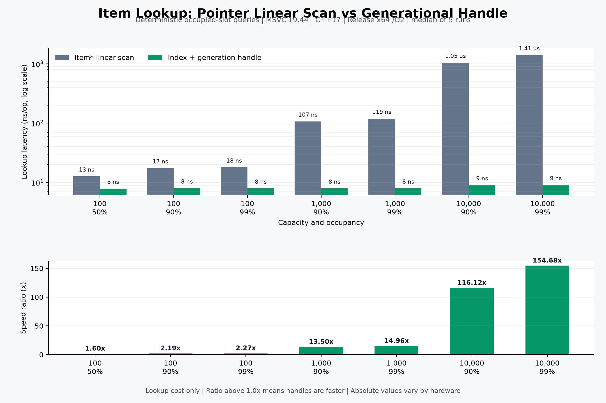

# 아이템 조회: 포인터 선형 탐색과 세대 핸들 비교

## 개선 전후

기존 `RemoveItem(Item*)`은 전달받은 포인터가 `_items` 배열의 몇 번째 슬롯인지 처음부터 비교했습니다. 슬롯 수가 N이라면 최악의 경우 N개의 포인터를 확인합니다.

개선 후에는 `ItemHandle`에 슬롯 번호와 세대 번호를 저장합니다. 슬롯 번호로 `_items`에 바로 접근하고 현재 세대와 핸들의 세대를 비교하므로 조회와 유효성 검사가 `O(1)`입니다.

## 측정 조건

- 컴파일러: Microsoft C/C++ 19.44.35219 x64
- C++17, Release x64, `/O2`, `/W4`, `/permissive-`
- 각 시나리오를 5회 실행한 중앙값
- 고정된 의사 난수 순서로 실제 점유 슬롯을 반복 조회
- 아이템 생성·소멸과 콘솔 출력 비용 제외
- `Ratio = 포인터 선형 탐색 시간 / 핸들 조회 시간`

## 결과

| 슬롯 수 | 점유율 | 포인터 선형 탐색 | 세대 핸들 | Ratio |
|---:|---:|---:|---:|---:|
| 100 | 50% | 12.69 ns/op | 7.91 ns/op | 1.60x |
| 100 | 90% | 17.45 ns/op | 7.98 ns/op | 2.19x |
| 100 | 99% | 18.00 ns/op | 7.93 ns/op | 2.27x |
| 1,000 | 90% | 107.03 ns/op | 7.93 ns/op | 13.50x |
| 1,000 | 99% | 119.13 ns/op | 7.96 ns/op | 14.96x |
| 10,000 | 90% | 1,049.75 ns/op | 9.04 ns/op | 116.12x |
| 10,000 | 99% | 1,407.60 ns/op | 9.10 ns/op | 154.68x |

## 트레이드오프

핸들 방식은 조회 시간을 줄이고 오래된 참조를 검출할 수 있지만, 추가 메모리와 상태 관리가 필요한 트레이드오프가 있습니다.

- 슬롯마다 `uint32_t` 세대 번호를 저장하므로 100슬롯 기준 약 400바이트를 추가 사용
- MSVC x64의 현재 구조에서 각 `ItemHandle`은 8바이트
- 아이템 삭제 시 세대 번호를 반드시 증가시켜야 함
- 외부 시스템은 장기 관찰용 `Item*` 대신 핸들을 보관해야 함
- 여러 보조 배열의 불변식을 유지하기 위한 구현과 테스트가 복잡해짐

현재 크기인 100슬롯에서도 상대적인 속도 향상은 확인됐지만 절대 차이는 약 5~10ns에 불과합니다. 따라서 성능만으로 반드시 필요한 구조라고 볼 수는 없습니다. 이 프로젝트에서는 오래된 참조가 재사용된 슬롯의 새 아이템을 잘못 가리키는 문제도 함께 방지한다는 점을 적용 근거로 삼았습니다.
