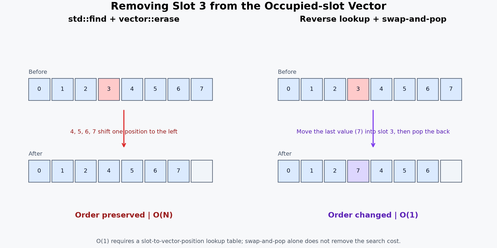
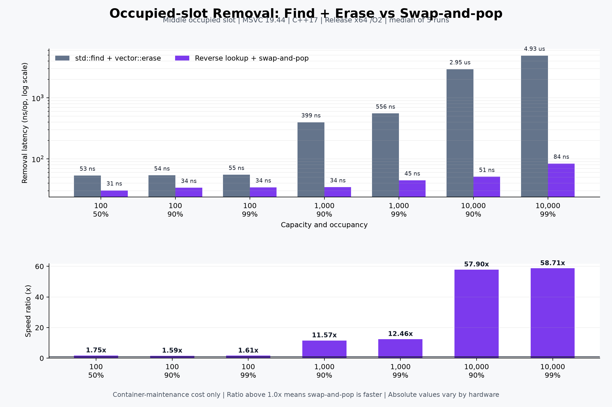

# 점유 슬롯 삭제 벤치마크

## 비교 대상

- 기존 방식: `std::find`로 슬롯의 위치를 찾고 `vector::erase`로 뒤 원소를 앞으로 이동
- 개선 방식: 슬롯별 벡터 위치를 역방향 위치표에 저장하고, 삭제할 원소에 마지막 원소를 덮어쓴 뒤 `pop_back`

두 방식 모두 강의 원본이 아닌 독립적으로 작성한 알고리즘 모델입니다. 벡터의 가운데에 있는 점유 슬롯 한 개를 삭제하는 상황을 측정했습니다.

## 측정 조건

- 측정일: 2026-09-07
- 컴파일러: Microsoft C/C++ 19.44.35219 x64
- C++17, Release x64, `/O2`, `/W4`, `/permissive-`
- 각 시나리오를 5회 실행한 중앙값
- 아이템 검색, 소멸, 콘솔 출력 비용 제외
- `Ratio = find + erase 시간 / swap-and-pop 시간`

## 결과

| 슬롯 수 | 점유율 | find + erase | swap-and-pop | Ratio |
|---:|---:|---:|---:|---:|
| 100 | 50% | 53.39 ns/op | 30.54 ns/op | 1.75x |
| 100 | 90% | 53.76 ns/op | 33.73 ns/op | 1.59x |
| 100 | 99% | 55.02 ns/op | 34.23 ns/op | 1.61x |
| 1,000 | 90% | 398.70 ns/op | 34.45 ns/op | 11.57x |
| 1,000 | 99% | 555.55 ns/op | 44.60 ns/op | 12.46x |
| 10,000 | 90% | 2,953.00 ns/op | 51.00 ns/op | 57.90x |
| 10,000 | 99% | 4,932.00 ns/op | 84.00 ns/op | 58.71x |

## 적용 판단

현재 프로젝트의 100슬롯에서도 점유 벡터 관리 비용이 약 1.6~1.8배 감소했고, 슬롯 수가 증가할수록 차이가 커졌습니다. `occupiedIdxVec`의 순서는 화면 표시나 정렬에 사용되지 않으므로 순서를 포기하는 비용도 현재 요구사항에는 영향을 주지 않습니다.

이에 따라 실제 `Inventory`에 슬롯 번호에서 `occupiedIdxVec` 내부 위치를 찾는 역방향 위치표와 `swap-and-pop`을 적용했습니다. 100슬롯 기준으로 `int` 위치표가 사용하는 추가 메모리는 일반적인 4바이트 `int` 환경에서 약 400바이트입니다.

이 측정은 전체 아이템 삭제가 아니라 **점유 슬롯 벡터를 정리하는 단계의 개선**을 증명합니다. 측정 당시 별도로 남아 있던 `RemoveItem(Item*)`의 포인터 선형 탐색은 이후 `ItemHandle`을 도입하여 제거했으며, 그 결과는 [핸들 조회 벤치마크](LOOKUP_RESULTS.md)에 분리해 기록했습니다.
