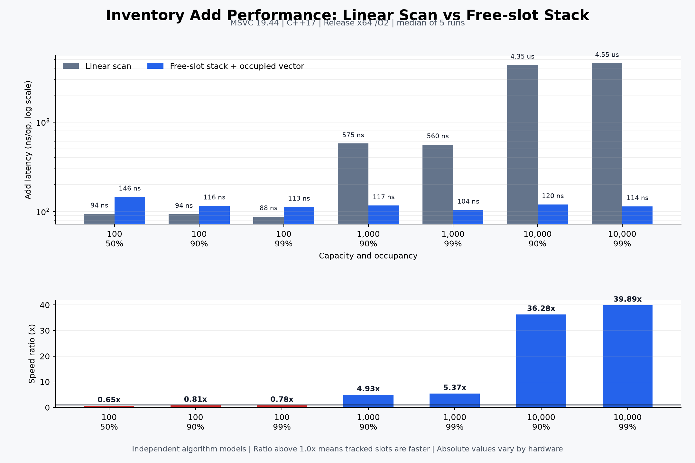

# Inventory 슬롯 탐색 벤치마크 결과

## 측정 목적

고정 배열을 앞에서부터 확인하는 선형 탐색 방식과, 빈 슬롯 인덱스를 별도로 추적하는 방식의 아이템 추가 비용을 비교했습니다.

두 구현은 강의 원본 코드가 아니라 알고리즘 비교를 위해 독립적으로 작성한 모델입니다. 측정 결과는 전체 인벤토리 시스템의 성능이 아닌 **아이템 추가 연산의 슬롯 관리 비용**만 설명합니다.

## 측정 조건

- 측정일: 2026-09-07
- 언어 표준: C++17
- 컴파일러: Microsoft C/C++ 19.44.35219 x64
- 빌드 옵션: Release x64, `/O2`, `/W4`, `/permissive-`
- 각 시나리오를 5회 실행한 중앙값
- 콘솔 출력과 실제 아이템 생성 비용 제외
- 낮은 `ns/op`가 더 좋은 결과
- `Ratio = 선형 탐색 시간 / 빈 슬롯 추적 시간`

## 결과

| 슬롯 수 | 점유율 | 선형 탐색 | 빈 슬롯 추적 | Ratio |
|---:|---:|---:|---:|---:|
| 100 | 50% | 94.16 ns/op | 145.88 ns/op | 0.65x |
| 100 | 90% | 93.58 ns/op | 115.98 ns/op | 0.81x |
| 100 | 99% | 87.78 ns/op | 112.60 ns/op | 0.78x |
| 1,000 | 90% | 575.20 ns/op | 116.60 ns/op | 4.93x |
| 1,000 | 99% | 559.80 ns/op | 104.20 ns/op | 5.37x |
| 10,000 | 90% | 4,354.00 ns/op | 120.00 ns/op | 36.28x |
| 10,000 | 99% | 4,548.00 ns/op | 114.00 ns/op | 39.89x |

## 해석

현재 프로젝트와 같은 100슬롯 환경에서는 선형 탐색 방식이 더 빨랐습니다. 작은 연속 메모리를 순회하는 비용보다 스택과 벡터를 함께 관리하는 비용이 더 크게 나타난 것으로 해석할 수 있습니다.

반면 1,000슬롯 이상에서는 빈 슬롯 추적 방식이 더 빨랐으며, 슬롯 수가 증가할수록 차이가 커졌습니다. 따라서 빈 슬롯 추적 방식은 항상 빠른 대체안이 아니라 **인벤토리 규모가 커질 때 탐색 비용을 일정하게 유지하기 위한 설계**로 보는 것이 적절합니다.

이 결과는 한 개발 환경에서 얻은 값이므로 절대적인 수치보다 슬롯 수 증가에 따른 경향을 중심으로 사용합니다. 제출 전 동일 조건에서 다시 측정해 결과가 반복되는지 확인합니다.
