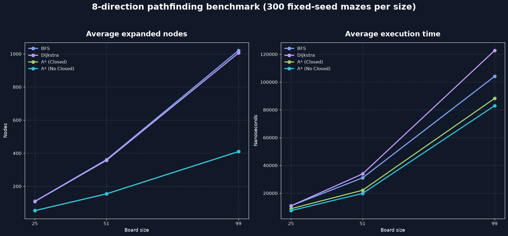

# Maze Pathfinding

Binary Tree 방식으로 생성한 미로에서 여러 경로 탐색 알고리즘을 직접 구현하고 비교한 C++17 학습 프로젝트입니다.

강의 예제를 실행하는 데서 끝내지 않고, 8방향 이동 정책에 맞는 휴리스틱을 선택하고 동일한 입력에서 최단 경로의 정확성과 탐색량을 수치로 검증했습니다.

## 구현 내용

- 우수법 미로 탐색
- 8방향 BFS
- 8방향 다익스트라
- Closed List를 사용하는 A*
- Closed List 없이 `best` 비용으로 오래된 후보를 거르는 A*
- 직접 구현한 `Vector`, `List`, `Stack`, `Queue`
- 고정 시드 반복 벤치마크와 CSV 출력

## 강의와의 차별화

### 8방향 이동에 맞춘 Octile 휴리스틱

상하좌우 비용을 10, 대각선 비용을 14로 정했습니다. 이 조건에서 Manhattan Distance는 대각선 한 번으로 이동할 수 있는 거리를 직선 두 번의 비용 20으로 평가하므로 실제 비용을 과대평가합니다.

Octile Distance는 `min(dx, dy)`만큼을 대각선 이동으로, 남은 차이를 직선 이동으로 계산합니다. 장애물을 무시했을 때의 최소 비용을 반환하므로 현재 8방향 이동 정책에 맞는 A* 휴리스틱으로 사용했습니다.

현재 구현은 대각선 목적지가 비어 있다면, 양옆에 벽이 있어도 벽 모서리 사이를 대각선으로 통과할 수 있습니다. 다익스트라와 A* 모두 같은 이동 방식을 사용하므로 결과 비교 조건은 동일합니다.

### 최단 비용 검증과 탐색 지표

각 알고리즘은 다음 측정값을 `PathfindingResult`로 반환합니다.

- 경로 발견 여부
- 최종 경로 비용과 이동 횟수
- 실제로 꺼내 확장한 노드 수
- 후보 자료구조에 삽입한 횟수
- 후보 자료구조의 최대 크기
- 탐색과 경로 복원에 걸린 시간

가중치 최단 경로를 보장하는 다익스트라를 기준으로 두 A*의 최종 비용이 같은지 자동으로 검사합니다.

## 벤치마크 결과

Release x64에서 25×25, 51×51, 99×99 미로를 각각 300개 고정 시드로 생성해 총 900개 입력을 비교했습니다.

A* (Closed)는 다익스트라보다 평균 확장 노드를 크기별로 약 51.0%, 56.7%, 59.3% 줄였으며, 두 A* 모두 900개 미로에서 다익스트라와 같은 최단 비용을 찾았습니다.



측정 환경, 전체 표와 결과 해석: [벤치마크 결과](benchmark/RESULTS.md)

## 주요 코드

- [`Player.cpp`](Player.cpp): BFS, 다익스트라, 두 A*와 Octile 휴리스틱
- [`PathfindingBenchmark.cpp`](PathfindingBenchmark.cpp): 고정 시드 반복 측정, 검증과 CSV 생성
- [`Board.cpp`](Board.cpp): Binary Tree 방식 미로 생성
- [`RandomUtils.cpp`](RandomUtils.cpp): `mt19937` 난수와 재현 가능한 시드 설정

## 빌드 및 실행

Visual Studio 2022에서 `Maze` 프로젝트를 시작 프로젝트로 선택해 실행하면 미로와 한 회 비교 결과를 함께 확인할 수 있습니다.

반복 벤치마크는 Release x64로 빌드한 뒤 저장소 루트에서 다음과 같이 실행합니다.

```powershell
Maze\x64\Release\Maze.exe --benchmark Maze\benchmark\pathfinding_results.csv
python Maze\benchmark\generate_chart.py
```
