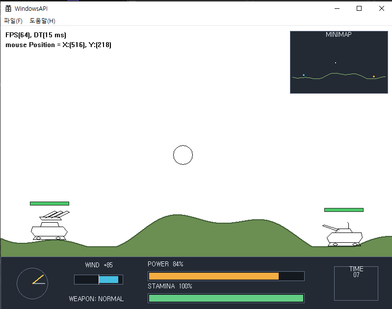

# C++ Study Portfolio

C++17을 중심으로 자료구조와 알고리즘부터 게임 프로그래밍에 필요한 구조까지 직접 구현하며 정리한 학습 저장소입니다. `std::format`을 사용하는 WindowsAPI 프로젝트는 C++20으로 빌드합니다.

단순히 강의 코드를 따라 작성하는 데서 끝내지 않고, 학습 중 생긴 **“왜?”를 주석으로 기록하고 경계 조건, 소유권, 시간 복잡도와 트레이드오프를 다시 검토하는 것**을 목표로 했습니다.

## 학습 목표

- 자료구조와 알고리즘의 내부 동작을 직접 구현하며 이해
- 코드가 동작하는 이유와 선택의 근거를 주석으로 설명
- 강의 예제에서 발견한 한계와 경계 조건을 직접 보완
- 시간 복잡도뿐 아니라 메모리 사용과 코드 복잡도의 교환 관계 확인
- 테스트와 벤치마크가 가능한 항목은 객관적인 결과로 검증

## 프로젝트

| 프로젝트 | 주요 내용 | 확인할 수 있는 것 |
| --- | --- | --- |
| [Inventory](Inventory/README.md) | 고정 크기 인벤토리 개선 | 소유권, 슬롯 추적, `swap-and-pop`, 세대 기반 핸들, 테스트와 벤치마크 |
| [DataStructures](DataStructures/README.md) | 트리, 힙, 그래프 탐색 | 인접 리스트·행렬 비교, 재귀·스택 DFS, BFS, 다익스트라 |
| [STL](STL/README.md) | STL과 기본 알고리즘 | 컨테이너 주의점, 함수 객체, 정렬 구현, 이진 탐색 트리, 동적 계획법 |
| [Maze](Maze/README.md) | 미로 생성과 경로 탐색 | 8방향 BFS·다익스트라·A*, Octile 휴리스틱, 정확성 검증과 벤치마크 |
| [WindowsAPI](WindowsAPI/README.md) | Win32 GDI 포트리스 | 객체·씬 소유권, 안전한 갱신, 지형·포탄 물리, 충돌·체력·미니맵 |

### Inventory

강의의 포인터 배열 기반 인벤토리에서 출발해 소유권과 탐색 비용을 다시 설계했습니다. `unique_ptr`, 빈 슬롯 스택, 역방향 위치표와 `swap-and-pop`, 세대 기반 `ItemHandle`을 적용했으며 자동 테스트와 성능 비교 결과를 함께 기록했습니다.

자세한 설계 판단과 측정 결과: [Inventory README](Inventory/README.md)

### DataStructures

트리와 힙의 기본 구조를 구현하고, 같은 그래프를 인접 리스트와 인접 행렬로 표현해 탐색 방법과 복잡도를 비교했습니다. 재귀 DFS, 명시적 스택 DFS, BFS와 다익스트라를 각각 실행할 수 있습니다.

표현 방식의 트레이드오프와 실행 결과: [DataStructures README](DataStructures/README.md)

### STL & Algorithm

표준 컨테이너와 알고리즘의 사용법뿐 아니라 반복자 무효화, 평균·최악 복잡도, 경계값을 함께 확인했습니다. HeapSort, MergeSort, QuickSort 등을 직접 구현하고 강의 예제와 다르게 판단한 부분을 코드와 문서에 남겼습니다.

직접 변경한 구현과 복잡도 정리: [STL README](STL/README.md)

### Maze Pathfinding

8방향 이동에서 BFS, 다익스트라와 두 방식의 A*를 구현했습니다. 직선 10·대각선 14의 이동 비용에 맞는 Octile 휴리스틱을 적용하고, 고정 시드 미로 900개에서 최단 비용 일치 여부와 확장 노드 수를 비교했습니다.

구현 판단과 반복 측정 결과: [Maze README](Maze/README.md)

### WindowsAPI Fortress

Win32 API와 GDI로 구현한 포트리스 강의 예제에서 객체·씬·선화 리소스의 소유권과 갱신 시점을 다시 설계했습니다. 굴곡진 지형과 탱크 이동, 바람·중력 기반 포탄, 충돌·체력·승패·재시작, 실제 게임 정보를 표시하는 미니맵을 추가했습니다.

강의에서 제공된 UI와 Menu 선화 데이터는 현재 버전에서 제거하고 GDI 도형 기반 UI와 직접 구성한 탱크 선화로 교체했습니다. 렌더링마다 생성하던 펜과 브러시도 초기화 시 한 번만 만들어 재사용하고, 폰트는 기본 GDI 객체를 사용합니다.

구조 변경과 게임 플레이 구현: [WindowsAPI README](WindowsAPI/README.md)

## 학습 기록의 구성 원칙

각 프로젝트 README에서는 다음 내용을 구분해 확인할 수 있도록 정리했습니다.

- 강의에서 학습한 기반 내용
- 직접 확장하거나 다르게 구현한 부분
- 구현 중 발견하고 수정한 문제
- 시간·공간 복잡도와 선택의 트레이드오프
- 검증 방법과 실행 결과

성능을 실제로 측정한 경우에는 실행 조건과 결과를 함께 기록하고, 측정하지 않은 항목은 이론 복잡도와 예상 효과로만 표현했습니다.

## 개발 환경

- Windows 10/11
- Visual Studio 2022 / MSVC v143
- C++17 중심, WindowsAPI 프로젝트는 C++20
- x64 Console / Win32 Application

## 빌드 및 실행

1. Visual Studio 2022에서 [`CppWorkspace.sln`](CppWorkspace.sln)을 엽니다.
2. 확인하려는 프로젝트를 시작 프로젝트로 설정합니다.
3. 각 프로젝트 README의 실행 방법과 주의점을 확인합니다.

Inventory는 Core, Demo, Tests, Benchmark 프로젝트로 분리되어 있습니다. DataStructures와 STL은 학습 주제에 따라 실행할 예제를 코드에서 선택하는 구조이며, WindowsAPI는 탱크 선화 파일을 불러오기 위해 프로젝트 폴더를 작업 경로로 사용합니다.
