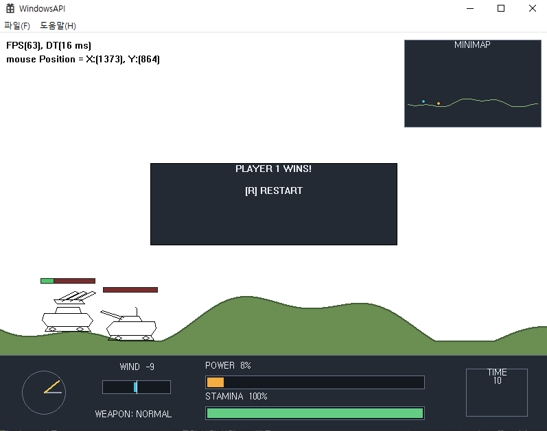
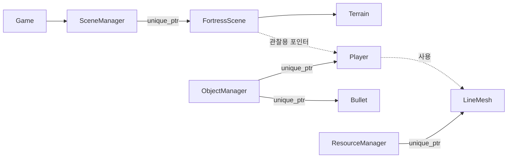

# WindowsAPI Fortress

Win32 API와 GDI로 간단한 포트리스 게임을 구현하며, 게임 루프와 객체·씬·리소스 관리 구조를 학습한 프로젝트입니다.

화면에 탱크와 포탄을 그리는 예제에서 끝내지 않고, 객체의 소유권과 갱신 시점에서 발생할 수 있는 문제를 다시 검토했습니다. 굴곡진 지형, 바람과 중력, 충돌과 체력, 승패와 재시작까지 추가해 한 판의 게임 흐름이 완성되도록 확장했습니다.

## 프로젝트 목표

- Win32 메시지 루프와 GDI 기반 더블 버퍼링 이해
- 객체, 씬, 선화 리소스의 소유자를 코드에서 명확하게 표현
- Update 도중 객체와 씬이 변경되어도 안전한 갱신 구조 구현
- 일정한 가속도를 반영하는 포탄 이동과 충돌 처리 구현
- 프레임마다 반복되는 GDI 펜·브러시·폰트 생성 제거

## 강의 기반과 직접 변경한 부분

이 프로젝트는 Win32 API 기반 포트리스 강의 예제를 학습하며 시작했습니다. 기본적인 윈도우 생성과 입력, GDI 그리기, 객체·씬 관리 흐름을 바탕으로 다음 부분을 직접 변경하거나 확장했습니다.

- `Object`, `Scene`, `LineMesh`의 소유권을 `std::unique_ptr`로 관리
- Update 도중 요청된 객체 추가·삭제와 씬 전환을 Update가 끝난 뒤 처리
- 굴곡진 지형을 생성하고 탱크가 현재 지면 높이에 맞춰 이동하도록 구현
- 바람과 중력이 적용되는 포탄 이동 구현
- 포탄과 탱크·지형의 충돌, 체력, 승패 판정과 재시작 구현
- 지형, 두 탱크와 비행 중인 포탄을 표시하는 미니맵 구현
- 렌더링마다 만들던 GDI 펜과 브러시를 초기화할 때 한 번만 만들어 재사용하고, 폰트는 기본 GDI 객체를 사용
- 강의에서 제공된 UI와 Menu 선화 데이터를 제거하고 GDI 도형 기반 UI로 교체
- 탱크 선화 데이터를 직접 구성한 단순한 좌표 데이터로 교체

현재 버전에는 강의에서 제공된 `UI.txt`, `Menu.txt`를 포함하지 않습니다. UI는 사각형, 선, 원과 텍스트를 조합해 코드에서 직접 그립니다.

## 실행 결과

- 메뉴에서 게임 씬으로 전환
- 굴곡진 지형 위에서 두 탱크가 번갈아 이동하고 발사
- 발사 시점의 힘, 각도, 바람과 중력을 이용한 포탄 궤적 계산
- 포탄이 지형·상대 탱크와 충돌하거나 화면 밖으로 나가면 다음 플레이어로 턴 전환
- 상대 탱크 피격 시 체력 25 감소
- 체력이 0이 되면 승자를 표시하고 `R` 키로 게임 재시작
- 미니맵에서 지형, 탱크와 비행 중인 포탄 확인

### 포탄 발사와 미니맵

힘을 충전해 포탄을 발사하면 현재 각도와 바람, 중력에 따라 포탄이 이동합니다. 우측 상단 미니맵에는 지형과 두 탱크, 비행 중인 포탄의 위치가 함께 표시됩니다.


### 승패 판정과 재시작

포탄이 상대 탱크에 명중하면 체력이 감소합니다. 체력이 0이 되면 승자를 표시하고, `R` 키로 같은 씬을 새로 생성해 다시 시작할 수 있습니다.



전체 진행 영상: [FORTRESS 플레이 영상](./assets/fortress-demo.mp4)

## 주요 구현

### 객체와 씬의 수명 관리

`ObjectManager`는 객체를 `std::unique_ptr<Object>`로 소유합니다. 외부에서는 잠시 사용할 관찰용 포인터만 전달받으므로, 실제 삭제 책임은 `ObjectManager` 한 곳에 모입니다.

객체 Update 도중 바로 벡터에 원소를 추가하거나 삭제하면 반복자가 무효화될 수 있습니다. 따라서 이때 요청된 작업은 대기 목록에 저장하고, 전체 Update가 끝난 뒤 반영합니다.

삭제할 객체를 찾는 과정은 `O(N)`이지만, 찾은 뒤에는 마지막 객체와 자리를 바꾸고 `pop_back`하여 나머지 원소를 한 칸씩 이동하지 않습니다. 객체의 표시 순서가 중요하지 않기 때문에 순서 보존보다 삭제 시 이동 비용을 줄이는 쪽을 선택했습니다.

`SceneManager`도 현재 씬을 `std::unique_ptr<Scene>`으로 소유하며, Update 도중 요청된 씬 전환은 Update가 끝난 뒤 적용합니다. 게임 종료 후 같은 씬을 다시 생성하는 재시작 기능도 같은 흐름을 사용합니다.

관련 코드: [`ObjectManager.cpp`](ObjectManager.cpp), [`ObjectManager.h`](ObjectManager.h), [`SceneManager.cpp`](SceneManager.cpp), [`SceneManager.h`](SceneManager.h)

### 소유 관계



`FortressScene`이 보관하는 `Player*`는 소유권 없는 관찰용 포인터입니다. 플레이어의 실제 수명은 `ObjectManager`가 관리하며, 현재 게임에서는 씬이 끝날 때까지 두 플레이어를 삭제하지 않습니다. 씬이 바뀔 때는 객체를 먼저 정리한 뒤 새 씬을 초기화합니다.

### 지형과 탱크 이동

`Terrain`은 화면의 각 X 좌표에 대응하는 지면 높이를 보관합니다. 두 개의 `sin` 파형을 합쳐 항상 같은 굴곡을 만들고, 렌더링과 충돌 판정, 미니맵이 같은 높이 데이터를 사용합니다.

탱크가 생성되거나 좌우로 이동하면 현재 X 좌표의 지면 높이를 구해 Y 좌표를 다시 맞춥니다.

```cpp
_pos.y = _terrain->GetGroundY(_pos.x) - GPlayerGroundOffset;
```

관련 코드: [`Terrain.cpp`](Terrain.cpp), [`Terrain.h`](Terrain.h), [`Player.cpp`](Player.cpp)

### 바람과 중력을 반영한 포탄 이동

화면 좌표계에서는 아래쪽이 `+Y` 방향입니다. 중력은 Y축 가속도, 바람은 X축 가속도로 저장하고, 매 프레임 일정 가속도 운동 공식을 적용합니다.

```cpp
position += velocity * deltaTime
          + acceleration * (0.5f * deltaTime * deltaTime);
velocity += acceleration * deltaTime;
```

발사 시점의 바람을 포탄에 저장하므로 포탄이 비행하는 동안 UI의 값이 바뀌더라도 궤적에 사용되는 가속도는 유지됩니다.

관련 코드: [`Bullet.cpp`](Bullet.cpp), [`Bullet.h`](Bullet.h), [`Player.cpp`](Player.cpp), [`Values.h`](Values.h)

### 충돌, 체력과 턴 진행

포탄 이동 직후 `FortressScene`에서 다음 순서로 비행 종료 여부를 확인합니다.

1. 화면 바깥으로 이탈했는지 확인
2. 발사자를 제외한 상대 탱크와 원 충돌 검사
3. 포탄의 아래쪽이 현재 X 좌표의 지면에 도달했는지 확인

탱크가 지면과 맞닿아 있으므로 탱크 충돌을 지형보다 먼저 판정합니다. 반대로 검사하면 탱크에 닿은 포탄이 지면 충돌로 먼저 처리되어 피해가 적용되지 않을 수 있습니다.

발사 후에는 포탄 비행이 끝날 때까지 턴 타이머를 멈춥니다. 포탄이 사라지면 다음 플레이어에게 턴을 넘기며, 피격으로 체력이 0이 되면 턴 입력을 막고 승자를 표시합니다.

관련 코드: [`FortressScene.cpp`](FortressScene.cpp), [`Player.cpp`](Player.cpp), [`Bullet.cpp`](Bullet.cpp)

### 미니맵

미니맵은 장식용 패널이 아니라 현재 게임 정보를 축소해 표시합니다.

- 전체 지형 높이 데이터
- 플레이어 1·2의 위치
- 비행 중인 포탄의 위치

월드 좌표를 미니맵 사각형의 비율 좌표로 변환하므로, 실제 오브젝트가 이동하면 미니맵 표시도 함께 움직입니다.

관련 코드: [`FortressScene.cpp`](FortressScene.cpp), [`Terrain.cpp`](Terrain.cpp), [`UIManager.cpp`](UIManager.cpp)

### GDI 그리기 자원 재사용

기존 `UIManager`는 한 번 렌더링할 때 `CreateSolidBrush` 4회, `CreatePen` 1회, `CreateFont` 1회를 호출하고 같은 프레임에서 삭제했습니다. 현재는 필요한 펜과 브러시를 `Init`에서 만들고 이후 렌더링에서 재사용하며, 폰트는 기본 GDI 객체를 사용합니다. 직접 만든 자원은 종료하거나 다시 초기화할 때 `DeleteObject`로 정리합니다.

| UIManager 렌더 1회 기준 | 변경 전 | 변경 후 |
| --- | ---: | ---: |
| GDI 객체 생성 함수 호출 | 6회 | 0회 |
| `DeleteObject` 호출 | 6회 | 0회 |

이 표는 실행 시간 측정 결과가 아니라, 변경 전후 `UIManager`의 렌더 경로에 있는 API 호출 수를 센 결과입니다. 따라서 성능 향상 수치를 주장하기보다 매 프레임 반복되던 운영체제 자원 생성·해제 작업을 제거했다는 구조적 개선으로 설명합니다.

관련 코드: [`UIManager.cpp`](UIManager.cpp), [`UIManager.h`](UIManager.h), [`MenuScene.cpp`](MenuScene.cpp), [`Player.cpp`](Player.cpp)

### GDI 더블 버퍼링과 자원 해제

모든 장면을 메모리 DC의 비트맵에 먼저 그린 뒤, 한 프레임이 완성되면 `BitBlt`로 윈도우 DC에 복사합니다. 종료할 때는 메모리 DC에 원래 선택되어 있던 비트맵을 되돌린 다음 생성한 비트맵과 DC를 해제합니다.

관련 코드: [`Game.cpp`](Game.cpp), [`Game.h`](Game.h)

## 강의와의 차별화

- 생 포인터로 보관하던 객체·씬·선화 리소스의 삭제 책임을 `unique_ptr` 소유자로 통일
- Update 도중 컨테이너를 직접 변경할 때 발생할 수 있는 반복자 무효화 방지
- 씬 Update 도중 현재 씬을 교체할 수 있던 흐름을 지연 전환 방식으로 변경
- 탱크 방향에 따라 선화의 X축 크기를 반전해 서로 마주 보도록 수정
- 탱크 충돌보다 지형 충돌을 먼저 검사하면 피해가 누락될 수 있는 판정 순서 수정
- 범위가 달라져도 이전 분포를 재사용하던 난수 함수 수정
- 파일 로드 실패와 잘못된 선 개수에 대한 `LineMesh` 입력 검증 추가
- `Vector` 연산 함수의 const 적용과 `operator*=` 반환 형식 수정
- 선택된 GDI 객체를 원래 객체로 되돌린 뒤 안전하게 해제하도록 종료 순서 수정

## 조작 방법

| 키 | 동작 |
| --- | --- |
| `E` | 메뉴에서 게임 시작 |
| `A` / `D` | 현재 탱크 좌우 이동 |
| `W` / `S` | 포신 각도 조절 |
| `Space` 누르기 | 발사 힘 충전 |
| `Space` 떼기 | 포탄 발사 |
| `R` | 승패 결정 후 게임 재시작 |

## 개발 환경

- Windows 10/11
- Visual Studio 2022 / MSVC v143
- C++20 (`std::format` 사용)
- Win32 API / GDI
- x64 Debug·Release

## 빌드 및 실행

1. Visual Studio 2022에서 [`CppWorkspace.sln`](../CppWorkspace.sln)을 엽니다.
2. `WindowsAPI`를 시작 프로젝트로 설정합니다.
3. 구성을 `Debug | x64` 또는 `Release | x64`로 설정합니다.
4. 프로젝트 디렉터리를 작업 경로로 실행합니다.

탱크 선화 데이터를 상대 경로로 불러오므로 실행 작업 경로는 `WindowsAPI` 폴더여야 합니다.
